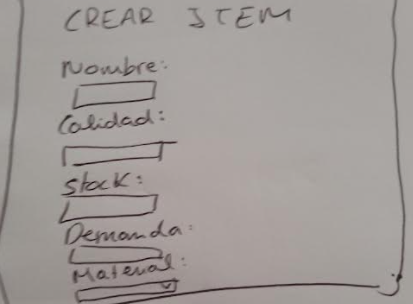
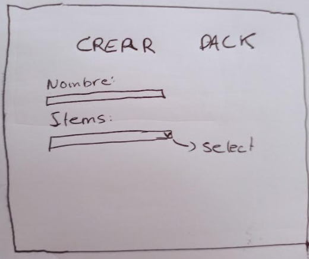
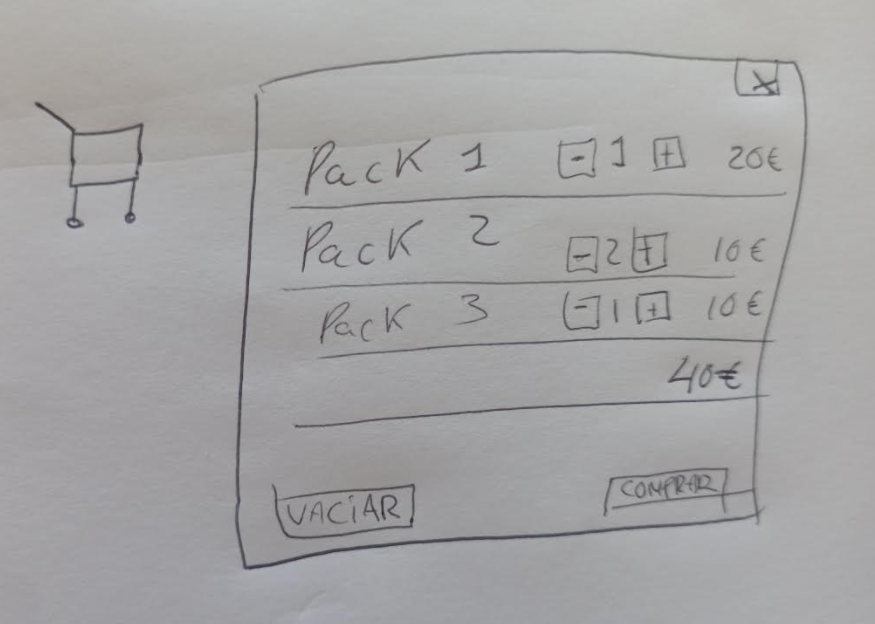

# Projecte-final
## Tabla de contenidos
- [Introducción](#introducción)
    - [Datos](#datos)
    - [Descripción](#descripción)    
    - [Objetivos](#objetivos)  
        - [Objetivos de software](#objetivos-de-software)
        - [Objetivos personales](#objetivos-personales)

    - [Tecnologías](#tecnologías)  
- [Desarrollo de la aplicación](#desarrollo-de-la-aplicación)  
    - [Planificación](#planificación)  
    - [Análisis previo](#análisis-previo)
        - [Historias de usuario](#historias-de-usuario)
        - [Modelo de datos](#modelo-de-datos)    
        - [Borrador de pantallas](#borrador-de-pantallas)    
    - [Proceso de implementación](#proceso-de-implementación)  
    - [Producción](#producción)  
         - [Resultado final](#resultado-final)
        - [Despliegue](#despliegue) 
- [Resultados y conclusiones](#resultados-y-conclusiones)  
- [Webgrafía](#webgrafía)


## Introducción
### Datos
- **Título del proyecto**: Tienda
- **Datos de los Autores**: Berta Vergés Rodríguez
- **Ciclo Formativo**: Desarrollo de aplicaciones web
- **Fecha de entrega**: 8 de junio de 2022
- **Link del Despliegue**:
- **Link del Proyecto**: 
### Descripción
Finalmente, se trata de una aplicación de venta de Packs compuestos de items. Los items pueden pertenecer a uno o varios packs y los packs pueden contener uno o varios items.Las propiedades de los items son stock, nombre,  precio, calidad y  material).  La virtud de la aplicación es que al crear un nuevo pack para sacarlo al mercado, no hace falta calcular el precio, el stock, ni la calidad. Estas propiedades se calculan solas sifuiendo el siguiente algoritmo:
- El stock del pack será igual al menor stock de sus items. Esto es: si tienes un pack compuesto por un item A con un stock de 4 unidades y un item B con un stock de 20 unidades, el stock del pack será de 4 (ya que cuando se termine el objeto A ya no se podrá vender más el pack).
- El precio es la suma de los precios de los items más un porcentaje de descuento (15%) por el hecho de pertenecer a un pack.
- La calidad se calcula de la siguiente manera: los packs de menos de 3 items son basic, 3 son standard y de 4 o más son premium.
He implementado la posibilidad de crear items, crear packs (a partir de items), editarlos o borrarlos. Además se pueden visualizar los packs y los items. También hay un carrito de la compra en el que añades objetos y te calcula el precio. Se puede vaciar, aumentar la cantidad de un objeto, disminuir la cantidad de un objeto y borrar ese objeto del carrito. 
### Objetivos
#### Objetivos de Software
- Este software pretende satisfacer la necesidad de una tienda online: 
Por una parte poder crear, modificar, ver y borrar ciertos elementos de una tienda (parte de gestión). Además, se trata de una aplicación en la cual a partir de items puedes crear packs, los cuales están a la venta. Las características de los packs se calculan (en el backend) en función de ciertas reglas de negocio, de manera que al crear o editar un pack no es necesario pensar en qué precio ponerle o qué stock queda, basta con añadir los items y hay una lógica por detrás que te genera los packs. 
Por otra parte poder añadir objetos a un carrito pudiendo calcular el precio final y comprarlos (la compra no se ha implemetado). También era objetivo la gestión de usuarios: tener un rol de sdminidtrsdor y otro de cliente de manera que el admin puede crear, borrar y editar packs (o items), y el cliente solo comprarlos. Uno de los objetivos es hacer un software lo más usable y visualmente atractivo posible.
 
#### Objetivos personales
-  Dentro de los objetivos personales está el hecho de poder crear un software de cero por primera vez pudiendo tener una parte front y una parte back. Quería tocar todos los conocimientos aprendidos durante el curso: desarrollo de API rests, maquetación front (y fetch), programación funcional, localStorage... A nivel de gestión de proyectos también tenía el objetivo de aprender a llevar un proyecto entero por mi cuenta (en todas sus fases), aprender a gestionar el estrés, y aprender a ser constante. Lo más importante en este proyecto es aprender tanto de los aciertos como de los errores.
### Tecnologías
#### Front
- Para el front he usado el framework **Vue**.  Elegí Vue porque es el framework que más conocía (el único que habíamos llegado a tocar en clase), y me parece una manera de simplificar el trabajo y reusar código.
- **Vuetify** como librería de maquetación.  Vuetify me parece una librería muy fácil de usar y con componentes reusables y muy estéticos, no la había usado nunca y quería aprender a usarla. 
- **HTML** y **CSS**.
-  Como librería de validación en el front he usado [**Vuelidate**]((https://vuelidate.js.org/))
#### Back
- Para el back he usado **node** y **express** porque creo que para un proyecto pequeño como este son suficientes y simplifican mucho la conexión a base de datos.
#### Base de datos
- La base de datos es una **MongoDB** -> porque es rápida y flexible. Además he reutilizado parte de un proyecto anterior, el cual ya estaba hecho con mongoDB, node  y express

## Desarrollo de la aplicación
### Planificación

<p align="center">
  
</p>

En la imagen de arriba se puede ver la planificaciónn inicial. El proyecto estaba pensado para seguir una metodología iterativa o en espiral, es por eso que todas las fases del proyecto eran constantes durante todo el desarrollo (excepto el anteproyecto, que estaba pensado para hacerlo al inicio y no tocarlo, y la documentación y despligue, que planeé que fuera al final). De esta manera, paralelamente al desarrollo se hacían las pruebas, el análisis (decidir qué es prioritario y qué no, qué tengo medios para hacer y qué no soy  capaz de hacer, qué tecnologías usar...). En este sentido sí que se ha cumplido bastante el planning, con la salvedad del despliegue (que ha fecha de hoy no he conseguido hacer). Lo que no se habría cumplido sería la planificación de las semanas, empezando por el hecho de que al final pude empezar el proyecto más tarde de lo que tenía previsto (después de semana santa en vez de antes).

Además del diagrama adjunto,en algún momento puntual, cuando me he sentido abrumada por la cantidad de tareas que había por hacer en un momento dado, sí queme he ayudado con un pequeño panel kanban de las tareas que tenía pendientes a corto plazo. He usado un panel al estilo tradicional (con post-its). No se puede decir que haya ayudado la metodología kanban al completo, sino que me he apoyado de esta técnica cuando ha sido más necesario. Para un próximo proyecto implementaría la metodología desde el principio, creo que ayuda a ordenar las ideas, además que creo que el pasar las tareas al estado "DONE" e ir viendo gráficamente el avance del proyecto es un reforzador importante a nivel psicoloógico, que ayuda a estar motivado

### Análisis previo
#### Historias de Usuario.
Las historias de usuario iniciales eran las siguientes:
- Como usuario quiero una pantalla para ser capaz de ver el stock de los productos
- Como usuario quiero autenticación para poder hacerme una cuenta  y loggearme
- Como usuario quiero una feature para poder adquirir los productos. Entonces su stock bajará
- Como gestor de la tienda quiero una feature para poder ver, crear, actualizar y borrar productos.
- Como dueño de la tienda quiero autorización para que dependiendo de los permisos que tenga el perfil, pueda solo comprar el producto (perfil de usuario) o bien poder hacer operaciones con el inventario (perfil de gestor)


Por diversos motivos no se han podido satisfacer las historias de usuario, algunos requerimientos han cambiado y otros han quedado para una segunda fase, en el apartado de conclusiones hay un resumen más detallado.
#### Modelo de datos
##### Modelo de referencia
Como he comentado anteriormente, he utilizado **MongoDB**. MongoDB es una base de datos **no relacional**. A pesar de ello, se pueden tener varias coleciones y "relacionarlas" (valga la contradicción con el nombre "no-relacional") mediante **referencias**. He utilizado esta opción, tengo dos colecciones, una de las cuales contiene referencias a la otra. A pesar de que así se pierde un poco el encanto que tiene MongoDB de manejarlo todo en un documento. Sin embargo, la decisión de tener dos colecciones fue más una decisión orientada al aprendizaje y a aprender cosas nuevas (ya que creo que en última instancia ese es el objetivo principal de ese proyecto) que una decisión con justificación técnica. 

Visto que el proyecto trata de Packs que contienen **items**(en notación UML podríamos afirmar que es items y packs mantienen una relación de **agregación**, esto es m-n) la asociación entre colecciones se da de la siguiente manera:
- Cada item tiene un id (además de otras propiedades como nombre, stock, calidad, demanda, precio y material)
- Cada pack tiene ciertas propiedades que no implican relación (id, nombre,precio, calidad, stock). Por otro lado, también tiene una propiedad que SÍ implica "relación" (entendida como asociacion entre objetos) llamada "items". Esta propiedad es un array. El array contiene los ids de los items que vienen incluidos en el pack (recordemos que hemos dicho que los items tenían un id), y cada id hace referencia al objeto con esa id que está en la colección "items".
- Los items pueden pertenecer a uno o varios packs, los packs pueden contener uno o varios items
    <p align="center">
  
</p>

 ##### Esquema de los datos
   Concretando un poquito más sobre el modelo de datos, y más allá de las relaciones. El esquema sería el siguiente:
 - Para los items:
     - Nombre: tiene que ser único (no existir en base de datos otro item con el mismo nombre) y tener de 3 a 40 caracteres.
     - Calidad: tiene que ser un número entero entre 0 y 50 (la calidad es una especie de índice ficticio)
     - Demanda: tiene que ser un número entero entre 0 y 100 (la demanda es una especie de índice ficticio)
     - Material: el material puede ser indestructible, consumible o normal, es un tipo enumerado.
     - Precio: tiene que ser un número mayor que 0, puede ser un decimal.
     - Stock: tiene que ser un número entero mayor que 0
 - Para los packs:
     - Nombre: tiene que ser único (no existir en base de datos otro item con el mismo nombre) y tener de 3 a 40 caracteres.
     - Items: tiene que ser un array de ids de items (que en el fondo son la referencia a la entidad entera). Aunque los items se guarden mediante la referencia id, para crear o modificar packs, se añade el nombre de los items, es el back el que se encarga de la conversión.
#### Borrador de pantallas
##### Wireframe
Las pantallas son las siguientes: 

- Login   


- Form para crear items  


- Form para crear packs  


- Carrito de la compra   


- Login   
  

- Card de un elemento (tanto item como pack)  
  

- Pantalla todos los elementos (tanto items como packs)  


El principal cambio respecto a los wireframes es que, si bien en un principio las pantallas de formulario y las de vista de todos los elementos, iban a ser páginas diferentes, al final se ha replanteado la idea y el componente del formulario está en la misma vista que el componente de la lista de todos los objetos. Me ha parecido mucho más usable hacerlo así, ya que te ahorras clicks y pantallas innecesarias. Tengo la pantalla de packs con su formulario y los resultados y tengo la pantalla de items con su formulario y los resultados.
Además, ha habido otros cambios respecto al diseño como los botones, la inclusión de filtros, o el diseño de los inputs de los formularios, ha cambiado mucho el diseño respecto al wireframe original. Esto se debe a la metodología: como  comentaré más abajo he seguido una metodología en espiral, en cada iteración me replanteaba el diseño, con lo cual el wireframe que hice al principio es muy virgen en comparación con el diseño final.

##### Paleta de colores y fuente
<p align="center">
  
</p>

  En la imagen de aquí arriba se puede ver la paleta de colores. En la paleta que elegí priman colores relativamente fríos con el objetivo de transmitir una imagen de elegancia, parsimonia y calma. Por la misma razón, la elección de los colores es bastante minimalista, priorizando el color blanco y dejando los colores para acentuar partes importantes de la aplicación y colocándolos coherentemente para asegurar una buena experiencia de usuario (ejemplo: botón de borrar o snackbar de error al añadir un item repetido son rojos, ajustándose a la convención).
  
  La fuente utilizada es la Roboto, es la que viene por defecto con Vuetify y no la he cambiado porque me gusta y me parece un buen estándar. La había utilizado en proyectos anteriores más allá de vuetify. Es una fuente sin serifa y con aspecto redondeado lo cual da un aspecto elegante a la par que moderno. En [este enlace a la documentación de vuetify](https://vuetifyjs.com/en/styles/text-and-typography/#typography) se puede obtener más información sobre las tipografías. Tiene peculiaridades como el hecho de que los botones, a pesar de seguir usando la fuente Roboto, tienen la fuente en mayúscula.
   
### Proceso de implementación
#### Fases
La implementación ha tenido la fase de análisis, la fase de codificación, la fase de testing y la fase de documentación (tanto el presente documento como el anteproyecto).
Exceptuando la fase de documentación, que fue hecha al principio (anteproyecto) y ahora al final (documentación final del proyecto), el resto de fases se han ido dando iterativamente y paralelamente, en modo de metodología en espiral, de manera que: analizaba el diseño, la arquitectura y la funcionalidad de un posible desarrollo, lo codificaba, y por último lo probaba bien para detectar cualquier error. Periódicamente he ido haciendo pruebas de regresión para detectar si había algo que había dejado de funcionar.
#### Problemas

- He tenido problemas con el despliegue al tener el front y el back en repositorios separados.
- He tenido problemas con Vue a la hora de pasar datos de un módulo a otro. Al final he conseguido hacer un bind de ciertos datos, y para pasar funciones de un módulo a otro no me ha quedado otra opción que repetir código (por desconocimiento de Vue)
- He tenido problemas con el localStorage, ya que me ha costado gestionarlo al ser un string. Al final se ha solucionando parseando el string a JSON para operar con él, y parsear de nuevo ese JSON a string para almacenarlo en el localStorage.
- He tenido mucho problema para conseguir colocar una modal hasta que he aprendido a  hacerlo y le he cogido soltura.
- He tenido problemas con las colecciones de la base de datos y el modelo referencial. Me ha costado mucho saber como gestionar el borrado de los items, finalmente he decidido no implementarlo.
- He tenido problemas para hacer una pasarela de pago, ya que es una logística complicada a la hora de implementar una real.
#### Metodologías
 Como he comentado más arriba, he utilizado una metodología en espiral haciendo iteraciones entre todas las fases del desarrollo. Me ha parecido adecuada para un proyecto pequeño, con poco tiempo y con la presión de un deadline inamovible donde buscaba en todo momento un mínimo producto viable e ir mejorando poco a poco el producto. Además en momentos en los cuales las circunstancias lo han demandado, he utilizado técnicas de otras metodologías como puede ser el panel kanban. Para futuros proyectos utilizaré metodologías ágiles de manera más intensiva porque son las que han demostrado funcionar mejor.
 
## Producción
### Resultado final
 
- Formulario de creación de item   


- Pantalla de todos los items  


- Formulario de creación de pack   


- Pantalla de todos los packs   


- Vista de la tarjeta de packs desplegada  


- Modal para ver un item de un pack (clickando en uno de sus items)  


- Modal para editar un pack  


- Modal carrito de la compra  

- Pantalla de login (esta es accesible desde la ruta /login, pero en la aplicación no se encuentra ningún enlace a ella ya que la autenticación todavía no es funcional, queda para una segunda fase)

 
### Despliegue
He tenido problemas con el despliegue porque no he sabido cómo podía comentar la parte front y la parte back. A fecha de 7-7-2022 no hay despliegue hecho, sin embargo queda para una fase dos y es posible que en los próximos días lo haga. En todo caso el plan es que el despliegue se haga con Heroku, ya que después de haber investigado parece de las alternativas más sencillas y rápidas para desplegar. Además es gratuíta y no necesitas un servdor propio.

Hasta que no haya un despliegue el proceso para poder acceder al proyecto en local sería:
- Clonar [el repositorio con el backend](https://github.com/BertaVR/js-amenities-express) 
- Dede el repositorio del backend, abrir una consola y ejecutar el siguiente comando para it al directorio donde se encuentra el proyecto de node:
```shell script
 cd amenities
```
- A partir de dicho directorio instale el proyecto ejecutando el siguiente comando:
```shell script
 npm i
```

- Para iniciar la API del proyecto ejecute la siguiente frase:
```shell script
npm run serverstart
``````
- Una vez seguidos estos pasos ya estará la API funcionando en el puerto 3000 del localhost. En el repositorio del backend aparece más información sobre cómo pasar los tests y ejemplos de peticiones y respuestas. No lo coloco en esta documentación porque no se ajusta a los requerimientos de la misma
- A continuación, habrá que clonar el presente repositorio ( el front)
- Usando la versión de node, hay que ejecutar la siguiente sentencia para servir el frontend: 

```shell script
npm run serve
``````

- Una vez hecho esto, si desde el navegador accedes a http://localhost:8080/, ya tendrás disponible el pront conectado a la lógica del backend y la base de datos.

## Resultados y conclusiones
- Estoy muy contenta con la elección del framework y las librerías (Vuetify, Vuelidate). Aunque era el primer proyecto con VUe en el que aplicaba lógica, creo que puedo mejorar en temas de dominio del framework, y tengo muchas ganas de conocerlo más a fondo e investigar sin prisas.
- La elección de una base de datos no relacional no la repetiría.
Creo que con el tiempo que ha habido para terminar la aplicación he hecho un buen trabajo. Sin embargo, se han quedado puntos pendientes a incluir de cara a una fase 2:
    - Poder añadir la foto al producto.
    - Tal vez podría ser buena idea poder vender, editar y borrar los items (no solo los packs) -> Para ello habrá que migrar la base de datos a una relacional.
    - Poder implementar la pasarela de pago y una compra real.
    - El descuento que se aplica a la suma de los precios de los items al estar en un pack puede hacerse dinámico. Esto es: ahora mismo el descuento es un porcentaje fijo establecido (15%) se me ocurre que de cara a una fase dos se pueda elegir o modificar el descuento.
    - Al comprar un elemento habría que comprobar que hay stock del mismo (no lo he implementado porque no he llegado a implementar las compras, pero sería algo a tener en cuenta).
    - Faltan la autenticación y autorización. Las cuales son importantes para el proyecto y las he dejado para una fase dos porque aún tengo pendiente aprender sobre este tema.
    - También me gustaría refactorizar el código ya que, debido al desconocimiento del framework y a la falta de tiempo me he querido centrar en resultados rápidos y hay puntos a mejorar en cuanto a la mantenibilidad del código. Para una fase 2 tengo pendiente investigar más a fondo el funcionamiento de VUe y mejorar el código acordemente
## Webgrafía
-  [Ejemplo código navbar](https://www.w3schools.com/howto/howto_js_topnav_responsive.asp)
- [Ejemplo código login](https://codesandbox.io/s/0q4kvj8n0l)   
- [Ejemplo código filtros](https://codepen.io/yosafatade/pen/gyEKeW)  
- [icono shopping cart](https://www.flaticon.com/free-icons/shopping-cart)
- [Node](https://developer.mozilla.org/en-US/docs/Learn/Server-side/Express_Nodejs)
- [Vuetify](https://vuetifyjs.com/en/)
-  [Vuelidate, librería de validación](https://vuelidate.js.org/)
-  [Heroku](https://devcenter.heroku.com/articles/getting-started-with-nodejs)
-  [Principios del diseño web](https://docs.google.com/document/d/1jSeTGD8hoqMQDmt_Ni0i7zfQvEVK3yOkwMmQg-EvOic/edit)
